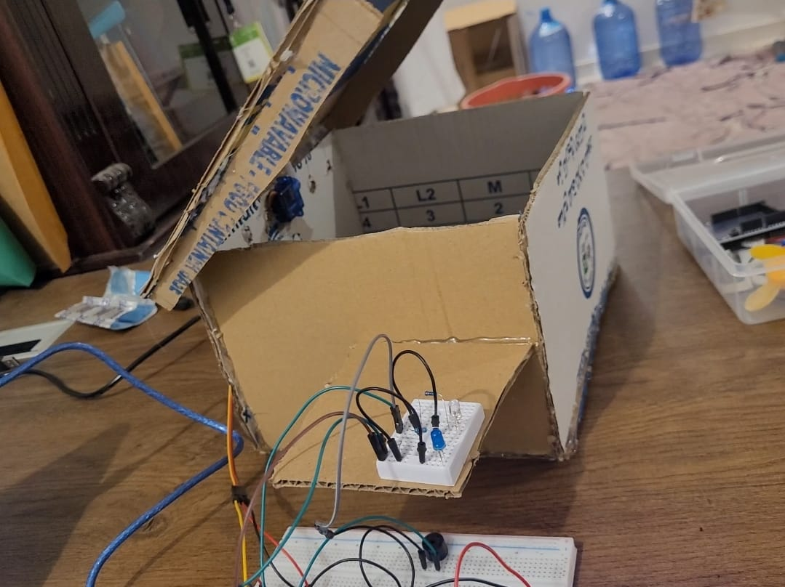
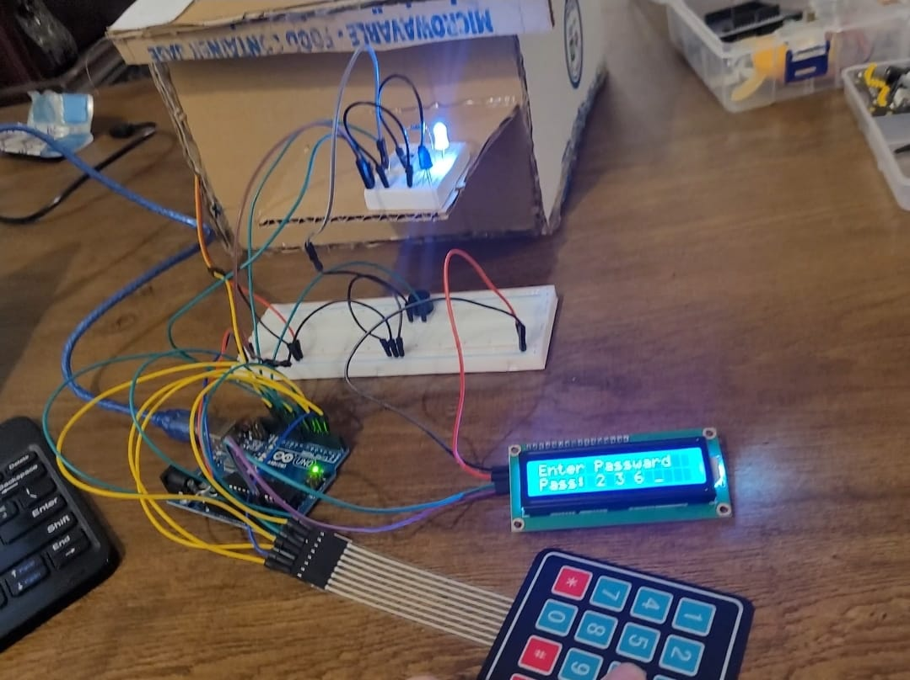
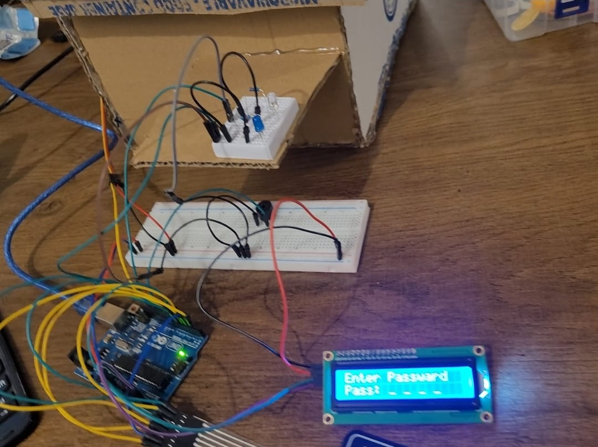

# Arduino---Safe-box


# Description:
The "Safe Box" project is a handmade cardboard box system featuring a keypad, LCD screen, white LED, blue LED, and a buzzer.

When powered on, the LCD prompts the user to enter a secret code. The currently entered code is displayed live on the screen.

If the correct code is entered:

The box opens.

The blue LED turns on.

The box remains open for 5 seconds, then automatically closes.

---

If the entered code is incorrect:

The buzzer sounds an error tone.

The box does not open, and the blue LED stays off.

---

While entering the code via the keypad:

A white LED lights up with each key press to indicate the input has been detected.


The project uses millis() instead of delay() to measure elapsed time, allowing the code to run without interruptions—an essential skill when building more interactive or advanced Arduino projects.


# Pictures:





# Code Below:
```cpp
#include <LiquidCrystal_I2C.h>
#include <Keypad.h>
#include <Servo.h>


Servo servo;
LiquidCrystal_I2C lcd(0x27, 16, 2);

/* @file CustomKeypad.pde
|| @version 1.0
|| @author Alexander Brevig
|| @contact alexanderbrevig@gmail.com
||
|| @description
|| | Demonstrates changing the keypad size and key values.
|| #
*/

const byte ROWS = 4; //four rows
const byte COLS = 4; //four columns
//define the cymbols on the buttons of the keypads
char hexaKeys[ROWS][COLS] = {
  {'1','2','3','A'},
  {'4','5','6','B'},
  {'7','8','9','C'},
  {'*','0','#','D'}
};
byte rowPins[ROWS] = {9, 8, 7, 6}; //connect to the row pinouts of the keypad
byte colPins[COLS] = {5, 4, 3, 2}; //connect to the column pinouts of the keypad

//initialize an instance of class NewKeypad
Keypad keypad = Keypad( makeKeymap(hexaKeys), rowPins, colPins, ROWS, COLS); 


byte blueLED = 13;
byte whiteLED = 10;
byte buzzer = 11;
byte pass[4];
byte correctPass[4] = {4,3,2,1};
byte count = 0;


long openTime = 0;
bool isOpen = false;
bool checkDone = true;


void gotKey() {
  for (byte time=0; time<2; time++){
    digitalWrite(whiteLED, HIGH);
    tone(buzzer, 700);
    delay(100);
    digitalWrite(whiteLED, LOW);
    noTone(buzzer);
    delay(100);
  }
}


void addKey(byte keyPassed) {
  putOnLCD(keyPassed, count+1);

  switch(keyPassed){
    case '1':
      pass[count] = 1;
      break;
  
    case '2':
      pass[count] = 2;
      break;

    case '3':
      pass[count] = 3;
      break;

    case '4':
      pass[count] = 4;
      break;

    case '5':
      pass[count] = 5;
      break;

    case '6':
      pass[count] = 6;
      break;

    case '7':
      pass[count] = 7;
      break;

    case '8':
      pass[count] = 8;
      break;

    case '9':
      pass[count] = 9;
      break;

    case '0':
      pass[count] = 0;
      break;

  }
}


void putOnLCD(char num, byte index) {
  switch(index){
    case 1:
      lcd.setCursor(6, 1);
      lcd.print(' ');
      lcd.setCursor(6, 1);
      lcd.print(num);
      break;
      
    case 2:
      lcd.setCursor(8, 1);
      lcd.print(' ');
      lcd.setCursor(8, 1);
      lcd.print(num);
      break;

    case 3:
      lcd.setCursor(10, 1);
      lcd.print(' ');
      lcd.setCursor(10, 1);
      lcd.print(num);
      break;

    case 4:
      lcd.setCursor(12, 1);
      lcd.print(' ');
      lcd.setCursor(12, 1);
      lcd.print(num);
      break;
  }
  
}


void setup() {
  lcd.init();
  lcd.backlight();
  Serial.begin(9600);
  servo.attach(12);
  servo.write(90);
  pinMode(blueLED, OUTPUT);
  pinMode(whiteLED, OUTPUT);
  pinMode(buzzer, OUTPUT);
  lcd.print("Enter Passward");
  lcd.setCursor(0,1);
  lcd.print("Pass: _ _ _ _");
}

void loop() {


  char key = keypad.getKey();
  
  if (key && count < 4){
    addKey(key);
    gotKey();
    count++;
    Serial.println(key);
  }

  else if (count == 4){
    Serial.println("Count = 4");

    for (byte z=0; z<4; z++){
      if (pass[z] != correctPass[z]) {
        checkDone = false;
        break;
      }
    } // END for loop

    if (checkDone) { // IF pass correct
      for (byte time=0; time<2; time++){
        digitalWrite(blueLED, HIGH);
        tone(buzzer, 700, 500);
        delay(500);
        digitalWrite(blueLED, LOW);
        delay(500);
      }

      if (isOpen == false) {
        Serial.println("IN condition");
        
        isOpen = true;
        openTime = millis();

        for (byte angle=90; angle>0; angle-=10){
          servo.write(angle);
          delay(200);
        }

      }


    } // End correct condition

    else{
      tone(buzzer, 700, 1500);
    }
  
    lcd.setCursor(6, 1);
    lcd.print("_ _ _ _");

    // reset values
    count = 0;
    checkDone = true;
    
    for (byte i=0; i<4; i++){
      pass[i] = 0;
    }

  } // END check count = 4

  if (millis() - openTime > 5000 && isOpen ==  true){ // Close after 5 seconds
    servo.write(90);
    delay(1000);
    isOpen = false;
  }

  Serial.println(millis() - openTime);
  delay(200);
}

```
